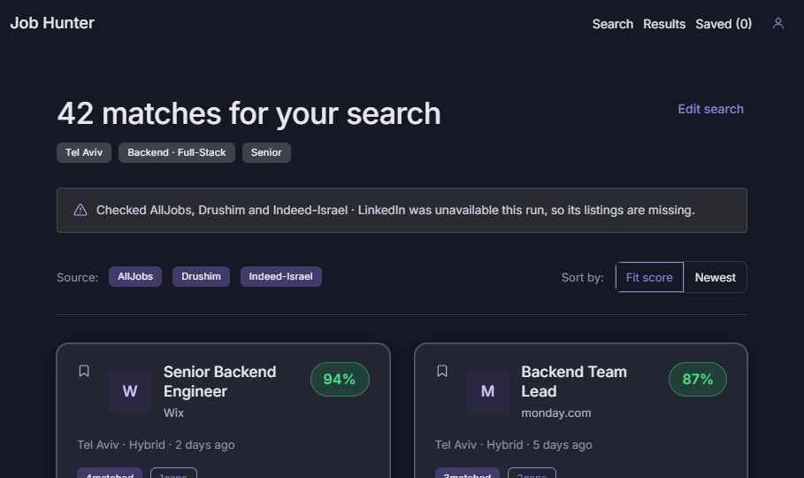

# Job Hunter

I built this during my own job search.

Looking for a developer job in Israel meant running the same search four times, on AllJobs, Drushim, LinkedIn and Indeed, then opening every listing and trying to guess whether I actually fit. I wanted one place that searches everything at once and tells me, honestly, where I match and where I don't.

That's what Job Hunter does. You give it a location, a domain and a level, plus your resume or a few lines about what you're looking for. It pulls listings from the four boards, removes duplicates, and ranks what's left by fit. For each job you see what matches, what's missing, and, if you want, how you could adjust your resume for it.

## The part I cared about most: no made-up matches

The easy version of this app asks an LLM "does this candidate fit this job?" and prints whatever comes back. The problem is that LLMs are happy to invent a requirement that isn't in the listing, or a skill that isn't on your resume. A job tool that lies to you is worse than no tool.

So every match or gap point the model returns has to quote the listing word for word. The app checks that the quote really exists in the listing text, and if it doesn't, the point is thrown away. Resume suggestions follow the same rule in the other direction: they can reword what you already did, never add something you didn't.

## How it's put together

- **Only the fuzzy part goes to the AI.** Location, domain and seniority are plain code, so they're fast, free and testable. The LLM (through OpenRouter, model set in config) only judges skills fit, which is the part rules can't do well.
- **One door to the job boards.** Each board is reached through an Apify scraper behind a single adapter layer. Scoring and UI code never talk to a scraper directly, so replacing a broken scraper doesn't ripple through the app.
- **When something breaks, you see it.** Scrapers and LLM calls retry a couple of times on network errors, no more, because every Apify retry can cost money. If a board is still down, the search carries on with the others and tells you which one is missing.
- **A failure demo you can click.** The search page has a "Run failure scenario" button that runs the real pipeline against scripted faults: one board recovers after two retries, one gives up, one fails a read and reuses its run, and every LLM call fails once before succeeding. It makes no external calls and costs nothing, and a log narrates each step as it happens.

**Stack:** Next.js 15, TypeScript, PostgreSQL with Drizzle, Auth.js (Google or email/password, hashed with scrypt), Apify, OpenRouter, Tailwind. Deployed on Vercel.

If you want the full reasoning behind these choices, it's in [`SPEC.md`](SPEC.md).

## Running it locally

1. `npm install`
2. Copy `.env.example` to `.env.local` and fill in:
   - `DATABASE_URL`: a Postgres connection string (the free tier of Neon or Supabase is enough)
   - `AUTH_SECRET`, `AUTH_GOOGLE_ID`, `AUTH_GOOGLE_SECRET`: for Auth.js and Google sign-in
   - `APIFY_TOKEN` and one actor ID per board
   - `OPENROUTER_API_KEY`: for the skills-fit scoring
3. `npm run db:generate && npm run db:migrate`
4. `npm run dev`

## Things worth knowing

- **Scrapers drift.** The field mappings in `lib/sources/*.ts` match common scraper output, but whichever Apify actor you pick for a board may name things differently. Expect to adjust them, and to swap actors now and then when one stops being maintained.
- **Results per board are capped on purpose** (`APIFY_RESULTS_PER_SOURCE`, 5 by default). Apify charges per result, and five good listings per board are enough to judge whether the matching works.
- **Retry limits live in two files:** `lib/sources/apifyRunner.ts` (up to 2 per board; a failed dataset read is retried without re-running the paid scraper) and `lib/openrouter.ts` (up to 2, only for network errors, timeouts, 429 and 5xx).
- **The failure demo's timings** (about 22 seconds end to end) can be changed with `DEMO_SPEED` in `lib/demo/faults.ts`.
